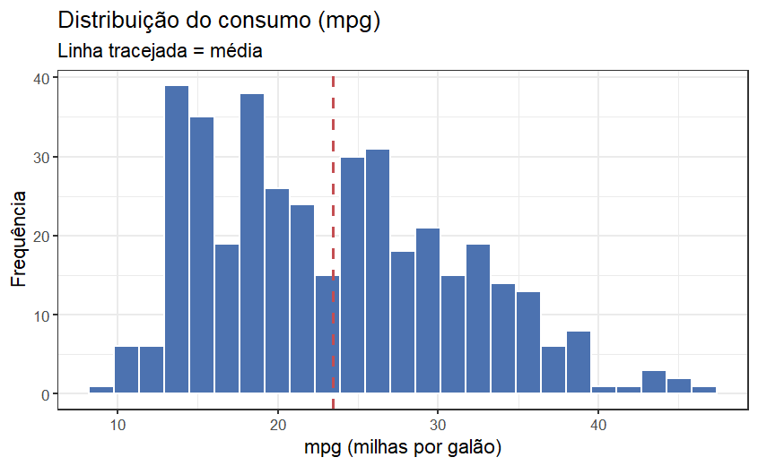
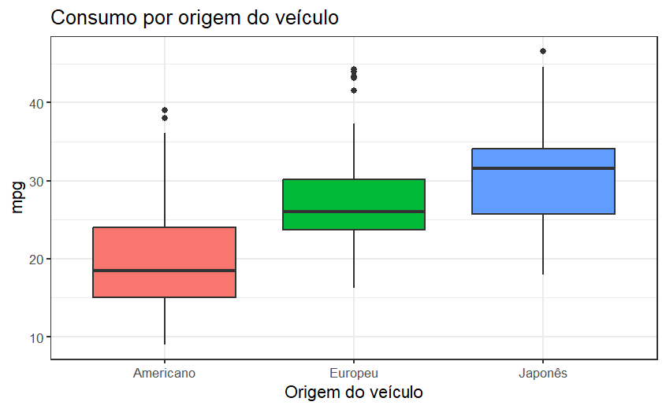
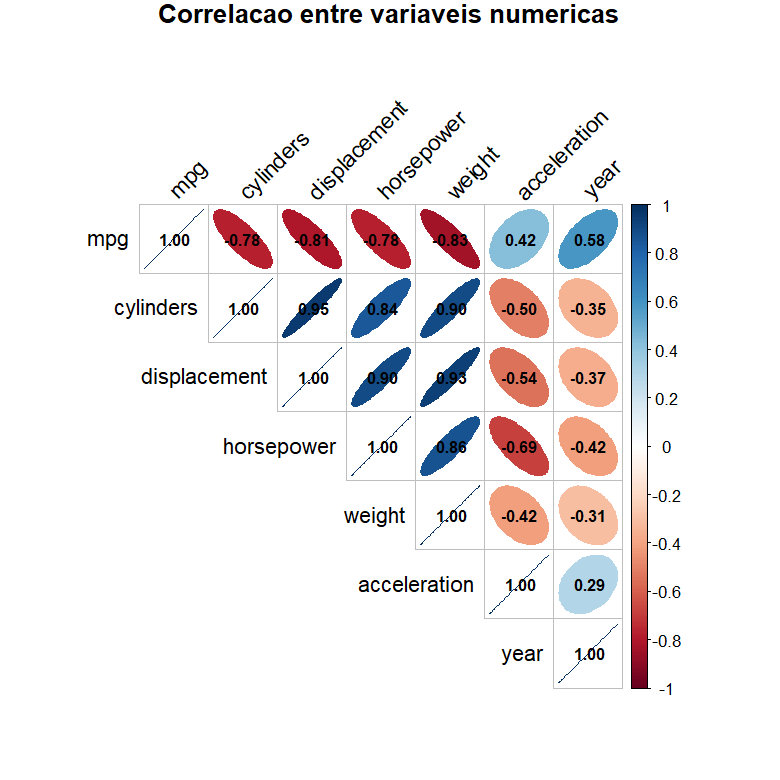
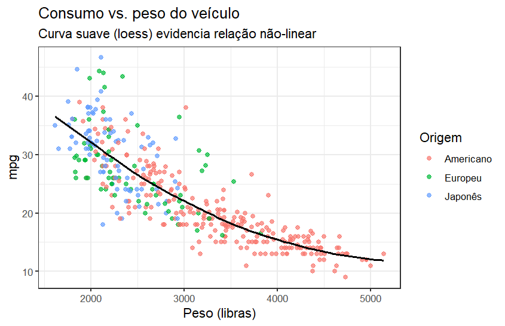

# Análise Exploratória da Base `Auto`

Documento de apoio para a atividade de Estatística Aplicada (2026.1) — visão geral da base de
dados e da análise exploratória inicial, antes da modelagem de regressão.

**Base:** [`05_Auto_ISLR.csv`](05_Auto_ISLR.csv) · **Objetivo:** modelar o consumo de combustível
(`mpg`) a partir das características técnicas e da origem do veículo.

---

## 1. Visão geral da base

- **392 automóveis**, modelos de **1970 a 1982**, com 9 variáveis.
- **Variável resposta:** `mpg` (milhas por galão — quanto maior, mais econômico).
- **Sem valores ausentes.** Esta é a versão tratada da base: o arquivo original tem 397 linhas,
  das quais 5 (com `horsepower` faltante) foram removidas.
- Uma variável (`name`) é apenas identificadora e não entra na modelagem.

| Papel | Variáveis |
|---|---|
| Resposta | `mpg` |
| Explicativas numéricas | `cylinders`, `displacement`, `horsepower`, `weight`, `acceleration`, `year` |
| Explicativa categórica | `origin` (americano / europeu / japonês) |
| Identificadora | `name` |

> **Atenção para a modelagem:** `origin` está gravada como número (1, 2, 3), mas é **qualitativa**
> — precisa ser convertida em fator, senão o R a trataria erroneamente como contínua.

---

## 2. Estatísticas descritivas

| Variável | Mín. | 1º Quartil | Mediana | Média | 3º Quartil | Máx. |
|---|---|---|---|---|---|---|
| `mpg` | 9,0 | 17,0 | 22,8 | 23,4 | 29,0 | 46,6 |
| `cylinders` | 3 | 4 | 4 | 5,5 | 8 | 8 |
| `displacement` | 68 | 105 | 151 | 194,4 | 276 | 455 |
| `horsepower` | 46 | 75 | 93,5 | 104,5 | 126 | 230 |
| `weight` | 1613 | 2225 | 2804 | 2978 | 3615 | 5140 |
| `acceleration` | 8,0 | 13,8 | 15,5 | 15,5 | 17,0 | 24,8 |
| `year` | 70 | 73 | 76 | 76,0 | 79 | 82 |

`cylinders` concentra-se em poucos valores (4, 6 e 8 cilindros): 199 carros têm 4 cilindros,
103 têm 8 e 83 têm 6 — apenas 7 carros têm 3 ou 5 cilindros.

---

## 3. Distribuição do consumo (`mpg`)

A distribuição do consumo é **assimétrica à direita**: a maioria dos carros consome entre 15 e
30 mpg, com uma cauda de veículos muito econômicos (até 46,6 mpg). Essa assimetria é uma primeira
pista de que uma **transformação da resposta** (por exemplo, logaritmo) pode ser útil na etapa de
modelagem.

---

## 4. Consumo por origem do veículo

| Origem | n | Média de `mpg` | Desvio-padrão | Mín. | Máx. |
|---|---|---|---|---|---|
| Americano | 245 | 20,0 | 6,4 | 9,0 | 39,0 |
| Europeu | 68 | 27,6 | 6,6 | 16,2 | 44,3 |
| Japonês | 79 | 30,5 | 6,1 | 18,0 | 46,6 |

Há uma diferença nítida: carros **japoneses e europeus são mais econômicos**, em média, do que os
**americanos** — coerente com o perfil da época (carros americanos maiores e mais potentes). Isso
sugere que `origin` pode ser uma variável explicativa relevante.

---

## 5. Correlações entre as variáveis

Ordenando a correlação de cada variável com o consumo:

| Variável | Correlação com `mpg` |
|---|---|
| `weight` | **−0,832** |
| `displacement` | −0,805 |
| `horsepower` | −0,778 |
| `cylinders` | −0,778 |
| `year` | +0,581 |
| `acceleration` | +0,423 |

Dois pontos se destacam:

1. **As variáveis de "porte do motor" têm forte relação negativa com o consumo:** carros mais
   pesados, com mais cilindros, mais cilindrada e mais potência consomem mais combustível
   (menos mpg). O peso é o melhor preditor individual.
2. **Essas mesmas variáveis são fortemente correlacionadas *entre si*** — `displacement` × `cylinders`
   = 0,95, `displacement` × `weight` = 0,93, `cylinders` × `weight` = 0,90 (as elipses azuis-escuras
   do gráfico). Isso é um forte indício de **multicolinearidade**, que precisará ser diagnosticada
   e tratada antes de interpretar os coeficientes de um modelo de regressão.

---

## 6. Relação entre consumo e peso

A relação entre `mpg` e `weight` é claramente **negativa, porém não-linear**: a curva é mais
íngreme para carros leves e se achata para carros pesados. Isso reforça a ideia de que uma
**transformação** (na resposta ou nas explicativas) pode melhorar o ajuste de um modelo linear.
O gráfico também mostra, pela cor, que os carros americanos se concentram na faixa mais pesada e
menos econômica.

---

## 7. O que a exploração já indica para a modelagem

- **Variável resposta assimétrica** → considerar transformação de `mpg`.
- **Multicolinearidade severa** entre `cylinders`, `displacement`, `horsepower` e `weight` → não
  faz sentido manter todas juntas no modelo; será preciso diagnosticar (via VIF) e selecionar.
- **`origin` é relevante** e deve entrar como variável categórica (dummy).
- **Relações não-lineares** (ex.: `mpg` × `weight`) a serem checadas no diagnóstico de resíduos.

Estes pontos orientam as próximas etapas: ajuste do modelo inicial, diagnóstico de
multicolinearidade, seleção do melhor modelo e verificação dos pressupostos.

---

*Documento gerado a partir de `05_Auto_ISLR.csv`; figuras na pasta [`figuras/`](figuras/).*
